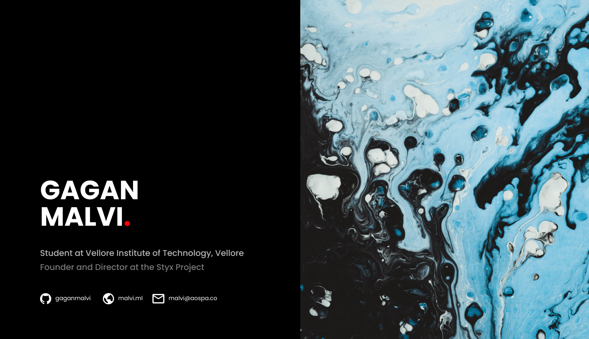

 

An amateur developer 🖥️ from India. 
Student of CSE at VIT, Vellore. 
- 🤖 Lead Developer and Founder at the Styx Project.  
- 📱 AOSP developer for Qualcomm and MediaTek devices, with experience in BSP development. 
- 🐍 Learning Kotlin, Python3, C, C++.  
- 📦 Love to play around with kernels and distros. 
- 📫 How to reach me: You may follow me on <a href="https://linkedin.com/in/gaganmalvi">LinkedIn</a> or <a href="https://t.me/gaganmalvi">Telegram</a> or via email at <a href="mailto:malvi@aospa.co">malvi@aospa.co</a> 
- 😄 Pronouns: he/him/his 

  

  

